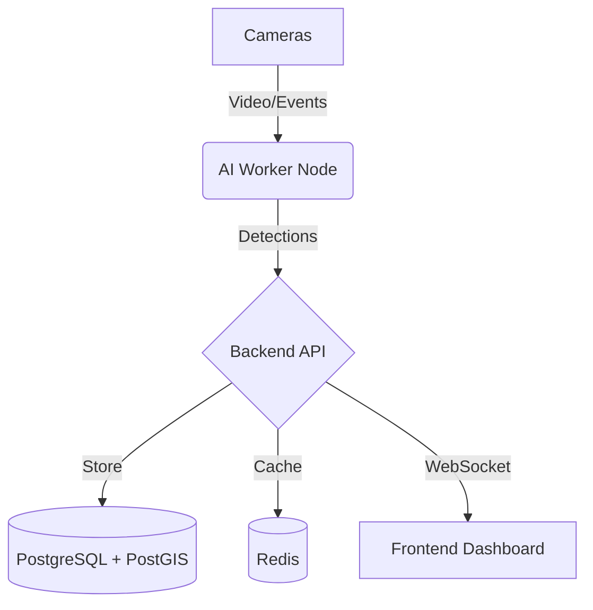

# Architecture

## System Overview

## Data Flow
Cameras stream to AI Workers -> AI extracts Plates -> Backend processes -> DB stores -> Frontend displays.

## AI Pipeline
Frame -> Object Detection (YOLO) -> Tracker (ByteTrack) -> OCR (PaddleOCR).

## Real-time Event Flow
Backend utilizes Redis Pub/Sub to push events to active WebSocket connections.
